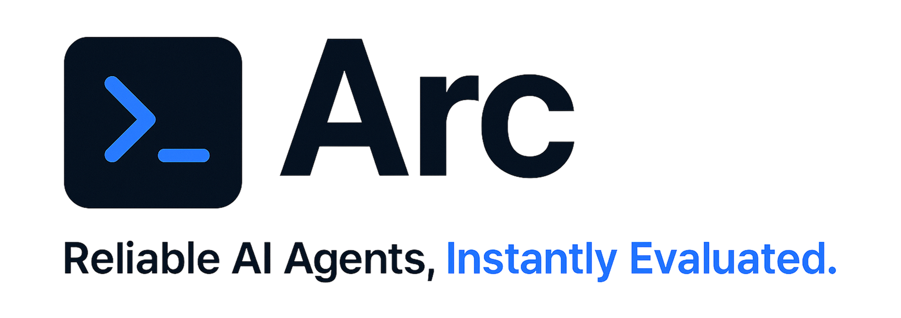
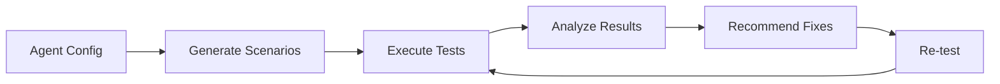

<div align="center">
  
</div>

<br>

<div align="center">

# Arc CLI: Proactive Capability Assurance for AI Agents

**CLI-native, framework-agnostic testing for AI agents. Test reliability, identify failures, and improve performance before production deployment.**

[](https://badge.fury.io/py/arc-cli)
[](https://opensource.org/licenses/MIT)
[](https://www.python.org/downloads/)

</div>

<br>

<div align="center">
  
</div>

<br>
<br>

Arc CLI tests any AI agent—regardless of framework—against **automatically generated scenarios** covering edge cases, failure modes, and assumption violations. Instantly spot reliability issues, capability gaps, and systemic problems. With four simple CLI workflows, Arc delivers actionable insights, continuous improvement, and comprehensive reliability reports—no code changes required.

It's built to be **agent-agnostic**, meaning you can bring your own agent (BYOA) regardless of the framework (LangChain, OpenAI, Anthropic, Google, etc.) and get actionable insights with minimal setup.

---

## Table of Contents
- [Quick Start](#quick-start)
- [Core Workflows](#core-workflows)
- [Key Features & Dashboard](#key-features--dashboard)
- [Flexible Input & Auto-Detection](#flexible-input--auto-detection)
- [Scenario Generation & Testing](#scenario-generation--testing)
- [How It Works](#how-it-works)
- [Examples & Integrations](#examples--integrations)
- [Advanced Usage](#advanced-usage)
- [Tips & Troubleshooting](#tips--troubleshooting)
- [License & Links](#license--links)

---

## ⚡ Quick Start (2 minutes)

> **💡 Pro Tip:** Use Modal for distributed execution (recommended for performance). No authentication needed with deployed app!

```bash
# 1. Install Arc CLI (Python 3.11+ required)
pip install arc-cli

# 2. Try it instantly with a sample agent configuration
arc run examples/configs/minimal_agent.yaml --scenarios 10

# 3. See all available commands and options
arc --help
```

<details>
<summary><strong>Next Steps with Your Agent</strong></summary>

> **⚠️ Important:** For LLM-based scenario generation, set your API key:  
> `export OPENROUTER_API_KEY="your-openrouter-api-key"`  
> _See [Flexible Input & Auto-Detection](#flexible-input--auto-detection) for details._

```bash
# For LLM-based scenario generation (optional but recommended for diverse scenarios)
export OPENROUTER_API_KEY="your-openrouter-api-key" # Or OPENAI_API_KEY

# Test your agent with generated scenarios
arc run your_agent.yaml --scenarios 50
arc analyze --run latest
arc recommend --json

# Or get the complete picture in one command
arc run your_agent.yaml --scenarios 100 --analyze

# Get guided help and explore workflows anytime
arc --help
```
</details>

---

## Core Workflows

> See [Scenario Generation & Testing](#scenario-generation--testing) for full coverage details.  
> See [Flexible Input & Auto-Detection](#flexible-input--auto-detection) for all configuration options.

<details>
<summary><strong>Run: "Test my agent's reliability"</strong></summary>

```bash
arc run your_agent.yaml --scenarios 50
```

</details>

<details>
<summary><strong>Analyze: "Why is my agent failing?"</strong></summary>

```bash
arc analyze --run latest
# Or analyze specific run
arc analyze --run abc123
```

</details>

<details>
<summary><strong>Recommend: "How do I make it better?"</strong></summary>

```bash
arc recommend --from-analysis latest # Uses insights from your last analysis
```

</details>

<details>
<summary><strong>Validate: "Is my configuration correct?"</strong></summary>

```bash
arc validate your_agent.yaml
```
This command checks your agent configuration for common issues and validates the format.

</details>

---

## Key Features & Dashboard

> **Hybrid Scenario Generation:** Arc CLI uses both pattern-based and LLM-generated scenarios to create comprehensive test suites. Pattern-based scenarios ensure coverage of known failure modes, while LLM generation creates novel edge cases.

### Interactive Progress Display
During execution, see real-time progress with detailed status updates:
```
🔍 Generating scenarios...
✓ Generated 50 scenarios (35 pattern-based, 15 LLM-generated)

🚀 Executing scenarios...
├── Scenario 1/50: malformed_response ✓ (0.8s)
├── Scenario 2/50: timeout_api_delay ✗ (5.2s)
└── Scenario 3/50: ambiguous_request ✓ (1.1s)

📊 Results: 42/50 passed (84% reliability)
```

### Comprehensive Analysis
The system tracks failure patterns and provides detailed insights:
*   **Failure Clustering**: Automatically groups similar failures to identify systemic issues
*   **Assumption Detection**: Identifies hidden assumptions in your agent's behavior
*   **Performance Metrics**: Tracks execution time, token usage, and cost per scenario
*   **Reliability Scoring**: Provides overall reliability percentage and grade

### Versatile Export Options
Easily share or archive your findings:
*   **JSON**: Structured data perfect for integration with monitoring systems or CI/CD pipelines
*   **CSV**: Raw data suitable for spreadsheet analysis or custom charting
*   **Terminal**: Rich, colored output for immediate insights during development

### 🚀 Key Features

#### Core Capabilities
- **🎯 Scenario Generation**: Pattern-based + LLM-generated test scenarios
- **⚡ Modal Execution**: Distributed, scalable sandbox execution
- **📊 Reliability Analysis**: Multi-dimensional scoring and grading
- **🔍 Assumption Detection**: AI-powered identification of hidden assumptions
- **📈 Performance Monitoring**: Real-time metrics and cost tracking
- **🗄️ Database Integration**: TimescaleDB for time-series analysis
- **🔄 Batch Processing**: High-throughput database operations (NEW!)

#### Production-Ready Features
- **🛡️ Circuit Breaker Pattern**: Resilient batch processing with automatic recovery
- **📦 Configurable Batching**: Customizable batch sizes and flush intervals
- **⚡ High Throughput**: Process >1000 records/second with batch operations
- **📊 Real-time Metrics**: Live monitoring of batch processing performance
- **🔧 Graceful Degradation**: Automatic fallback when services are unavailable

---

## Flexible Input & Auto-Detection

Arc CLI is designed to work with any agent configuration format and provides intelligent parsing and validation.

### Agent Configuration Formats

You can define your agent using YAML configuration files:

```yaml
# Basic agent configuration
model: gpt-4.1-mini
temperature: 0.7
system_prompt: |
  You are a helpful assistant that processes financial transactions.
  Always use USD for currency unless specified otherwise.
tools:
  - name: calculator
    description: Perform mathematical calculations
  - name: currency_converter
    description: Convert between different currencies
assumptions:
  - currency: USD
  - timezone: UTC
  - language: English
```

### Multiple Execution Modes

```bash
# 1. Local execution (default)
arc run agent.yaml --scenarios 50

# 2. Distributed execution with Modal (recommended for performance)
export ARC_USE_DEPLOYED_APP=true
arc run agent.yaml --scenarios 500

# 3. Pattern-only scenarios (no LLM required)
arc run agent.yaml --pattern-ratio 1.0 --scenarios 50

# 4. LLM-only scenarios (requires API key)
arc run agent.yaml --pattern-ratio 0.0 --scenarios 50

# 5. A/B testing between configurations
arc diff agent_v1.yaml agent_v2.yaml --scenarios 100
```

### Performance Optimization

For faster evaluation and cost optimization:

```bash
# Optimize scenario generation ratio
arc run agent.yaml --pattern-ratio 0.7 --scenarios 100  # 70% pattern, 30% LLM

# Use distributed execution for large test suites
export ARC_USE_DEPLOYED_APP=true
arc run agent.yaml --scenarios 1000

# JSON output for automation
arc run agent.yaml --json > results.json
```

**Performance Tips:**
- ✅ **Use Modal**: 10x faster execution with distributed processing
- ✅ **Optimize pattern ratio**: 70% pattern-based scenarios for cost efficiency
- ✅ **Use --json**: Essential for automation and CI/CD integration
- ✅ **Batch scenarios**: Automatically optimized for 50+ scenarios

### Automatic Configuration Detection

Arc CLI automatically detects and validates agent configurations. Just point Arc to your YAML file, and it will handle parsing, normalization, and validation.

**Examples of supported configurations:**

```yaml
# OpenAI-style configuration
model: gpt-4.1-mini
temperature: 0.7
system_prompt: "You are a helpful assistant."
tools:
  - name: web_search
  - name: calculator

# Anthropic-style configuration  
model: claude-3.5-sonnet
temperature: 0.3
system_prompt: "You are Claude, an AI assistant."
max_tokens: 4000

# Custom agent configuration
model: custom/my-model
temperature: 0.5
system_prompt: "Custom system prompt"
tools:
  - name: custom_tool
    description: "Custom tool description"
    parameters:
      type: object
      properties:
        query:
          type: string
```

Arc CLI intelligently extracts the core agent configuration, validates required fields, and normalizes the format for testing.

---

## Scenario Generation & Testing

<details>
<summary><strong>Show Scenario Generation & Testing Details</strong></summary>

### **Comprehensive Test Coverage**

Arc CLI provides **hybrid scenario generation** across multiple failure categories:

| **Category** | **Pattern-Based** | **LLM-Generated** | **Key Focus Areas** |
|------------|---------------|-------------------|---------------|
| **Input Validation** | Edge cases, malformed data | Novel input combinations | Data sanitization, type validation |
| **API Failures** | Timeout, rate limits, errors | Unexpected API responses | Error handling, retry logic |
| **Assumption Violations** | Currency, timezone, language | Context-specific assumptions | Hidden dependencies, defaults |
| **Tool Behavior** | Tool failures, missing tools | Complex tool interactions | Tool selection, error recovery |

### **Real-World Failure Scenarios**
- **Malformed Responses**: Test how agents handle incomplete or corrupted data
- **API Timeouts**: Validate timeout handling and retry mechanisms  
- **Assumption Violations**: Detect hidden assumptions about currency, language, timezone
- **Tool Failures**: Test behavior when tools are unavailable or return errors
- **Edge Cases**: Boundary conditions, empty inputs, extreme values

**Why This Matters**: While many testing frameworks focus on "happy path" scenarios, Arc CLI specializes in **failure modes** and **edge cases** that can cause production issues.

</details>

---

## How It Works



**The Arc Loop: Continuous improvement through systematic testing and analysis.**

1.  **Generate:** Arc creates diverse test scenarios using both pattern-based and LLM-generated approaches
2.  **Execute:** Your agent runs against scenarios in a sandboxed environment (local or distributed via Modal)
3.  **Analyze:** Results are analyzed for failure patterns, assumption violations, and performance issues
4.  **Recommend:** Arc generates specific configuration changes and improvements based on findings
5.  **Re-test:** Apply recommendations and re-run tests to measure improvement

> **📖 Complete Implementation Guide**: See [examples/](./examples/) for detailed configuration examples and integration patterns.

---

## Examples & Integrations

<details>
<summary><strong>Show Examples & Integrations</strong></summary>

> **📚 Complete Documentation**: See [`examples/configs/`](./examples/configs/) for comprehensive examples including:
> - [minimal_agent.yaml](./examples/configs/minimal_agent.yaml) - Basic agent setup
> - [finance_agent_v1.yaml](./examples/configs/finance_agent_v1.yaml) - Financial domain agent
> - [finance_agent_v2.yaml](./examples/configs/finance_agent_v2.yaml) - Enhanced multi-currency support
> - [audit_agent.yaml](./examples/configs/audit_agent.yaml) - Compliance-focused configuration
>
> **🔧 Practical Examples**: Explore [`docs/`](./docs/) for:
> - Framework-specific integration examples
> - CI/CD pipeline templates  
> - Advanced configuration patterns
> - Performance optimization guides

### Framework Integration Examples

```bash
# LangChain agents
arc run langchain_agent.yaml --scenarios 100

# OpenAI function calling
arc run openai_functions.yaml --scenarios 50

# Custom agent frameworks
arc run custom_agent.yaml --scenarios 75
```

### CI/CD Integration

```yaml
# GitHub Actions example
- name: Test Agent Reliability
  run: |
    arc run agent.yaml --scenarios 100 --json > results.json
    arc analyze --json | jq '.reliability_score'
```

</details>

---

## Advanced Usage

<details>
<summary><strong>Show Advanced Usage (Modal, A/B Testing, etc.)</strong></summary>

### Distributed Execution with Modal

```bash
# Enable Modal for high-performance distributed execution
export ARC_USE_DEPLOYED_APP=true
arc run agent.yaml --scenarios 1000

# Or use your own Modal deployment
export MODAL_TOKEN_ID="your-token-id"
export MODAL_TOKEN_SECRET="your-token-secret"
arc run agent.yaml --scenarios 500
```

### A/B Testing and Comparison

```bash
# Compare two agent configurations
arc diff agent_v1.yaml agent_v2.yaml --scenarios 100

# Compare with specific metrics
arc diff agent_v1.yaml agent_v2.yaml --scenarios 200 --json | jq '.comparison'
```

### Programmatic Usage

```python
from arc.scenarios.generator import ScenarioGenerator
from arc.simulation.modal_orchestrator import ModalOrchestrator

# Generate scenarios
generator = ScenarioGenerator("agent.yaml", api_key="your-key")
scenarios = await generator.generate_scenarios_batch(count=50)

# Execute with Modal
orchestrator = ModalOrchestrator()
results = await orchestrator.execute_scenarios(scenarios, agent_config)
```

### Environment Configuration

```bash
# Required for LLM-based scenario generation
export OPENROUTER_API_KEY="your-openrouter-key"
# Or use OpenAI directly
export OPENAI_API_KEY="your-openai-key"

# Optional: Database persistence
export TIMESCALE_SERVICE_URL="postgresql://..."

# Optional: Modal distributed execution
export MODAL_TOKEN_ID="your-token-id"
export MODAL_TOKEN_SECRET="your-token-secret"
```

</details>

---

## Tips & Troubleshooting

### ⚠️ Handling OpenRouter API Failures

If you encounter persistent errors (such as timeouts, 400 errors, or service outages) when using the OpenRouter API for scenario generation or evaluation, please note the following:

#### Problem

Currently, the system uses OpenRouter as a unified gateway for multiple LLM providers (OpenAI, Anthropic, Google, etc.). If OpenRouter is down, rate-limited, or returns errors, all LLM-based features will fail—even if you have valid API keys for the individual providers.

#### Solution: Fallback to Individual Provider APIs

**We recommend implementing a fallback mechanism:**  
If OpenRouter is unavailable or returns an error, the system should automatically attempt to use the individual provider's API directly (e.g., OpenAI, Anthropic, Google) using the corresponding API key from your environment.

```python
try:
    # Try OpenRouter first
    result = call_openrouter_api(...)
except OpenRouterError:
    # Fallback to direct provider API
    if provider == "openai":
        result = call_openai_api(...)
    elif provider == "anthropic":
        result = call_anthropic_api(...)
    # ...add more providers as needed
```

#### What to Do If You Experience Issues

- Double-check your `.env` file for all relevant API keys (e.g., `OPENAI_API_KEY`, `ANTHROPIC_API_KEY`, etc.).
- If OpenRouter is down, consider switching to direct provider APIs until service is restored.
- If you would like to contribute, PRs to add this fallback logic are welcome!

---

**Note:**  
This fallback mechanism is not yet implemented by default. If you rely on uninterrupted LLM access, please consider adding this logic or open an issue to request it.

> **Pro Tip:** Use `--pattern-ratio 1.0` for pattern-only scenarios that don't require LLM API calls.
> 
> **Note:** Arc CLI auto-detects many common agent configuration formats—no need to reformat your YAML files.
> 
> **Warning:** For LLM-based scenario generation, you must set your API key (see above for details).

---

## License & Links

**License:** MIT License - see [LICENSE](LICENSE) file for details.

**Contributing:** Contributions are welcome! Please read our contributing guidelines and submit pull requests to our repository.

**Support:**
- Documentation: `docs/` and `examples/`
- Issues: [GitHub Issues](https://github.com/arc-computer/arc-cli/issues)
- Discussions: [GitHub Discussions](https://github.com/arc-computer/arc-cli/discussions)

## ⚙️ Configuration

### Batch Processing Configuration

Arc CLI includes a high-performance batch processing system for production workloads:

```python
from arc.database.batch_processor import BatchConfig

# Configure batch processing
batch_config = BatchConfig(
    max_batch_size=100,           # Process 100 records at once
    flush_interval_seconds=30.0,  # Auto-flush every 30 seconds
    max_retries=3,                # Retry failed operations
    enable_circuit_breaker=True,  # Enable resilience patterns
    circuit_breaker_threshold=5,  # Open circuit after 5 failures
    circuit_breaker_timeout=60.0  # Recovery timeout in seconds
)
```

### Performance Benefits

| Feature | Individual Processing | Batch Processing | Improvement |
|---------|----------------------|------------------|-------------|
| **Throughput** | ~50 records/sec | >1000 records/sec | **20x faster** |
| **Database Load** | High (1 query/record) | Low (1 query/batch) | **100x reduction** |
| **Resilience** | Fail-fast | Circuit breaker | **Graceful degradation** |
| **Monitoring** | Basic | Real-time metrics | **Production-ready** |

### Batch Processing Features

<details>
<summary><strong>🔧 Advanced Configuration</strong></summary>

```python
# Production configuration example
production_config = BatchConfig(
    max_batch_size=500,           # Large batches for high throughput
    flush_interval_seconds=10.0,  # Frequent flushes for real-time data
    max_retries=5,                # More retries for production stability
    retry_delay_seconds=2.0,      # Exponential backoff starting at 2s
    enable_circuit_breaker=True,
    circuit_breaker_threshold=10, # Higher threshold for production
    circuit_breaker_timeout=120.0 # Longer recovery time
)

# Development configuration example
dev_config = BatchConfig(
    max_batch_size=10,            # Small batches for quick feedback
    flush_interval_seconds=5.0,   # Fast flushes for development
    max_retries=2,                # Fewer retries for faster failure detection
    enable_circuit_breaker=False  # Disabled for easier debugging
)
```

</details>

<details>
<summary><strong>📊 Monitoring & Metrics</strong></summary>

The batch processor provides comprehensive metrics:

```python
# Get real-time metrics
metrics = batch_processor.get_metrics()
print(f"Records per second: {metrics.records_per_second:.1f}")
print(f"Success rate: {metrics.successful_records / metrics.total_records:.2%}")

# Get current status
status = batch_processor.get_status()
print(f"Pending records: {status['pending_outcomes']}")
print(f"Circuit breaker: {status['circuit_breaker_state']}")
```

**Available Metrics:**
- Total batches processed
- Records per second throughput
- Success/failure rates
- Average batch size
- Circuit breaker state
- Last flush timestamp

</details>

<details>
<summary><strong>🛡️ Resilience Patterns</strong></summary>

**Circuit Breaker Pattern:**
- Automatically opens when failure threshold is reached
- Prevents cascading failures during outages
- Self-healing with configurable recovery timeout
- Half-open state for gradual recovery testing

**Retry Logic:**
- Exponential backoff for transient failures
- Configurable retry attempts and delays
- Preserves data integrity during network issues

**Graceful Degradation:**
- Automatic fallback to individual processing
- Continues operation even when batch processing fails
- Maintains data consistency across failure modes

</details>